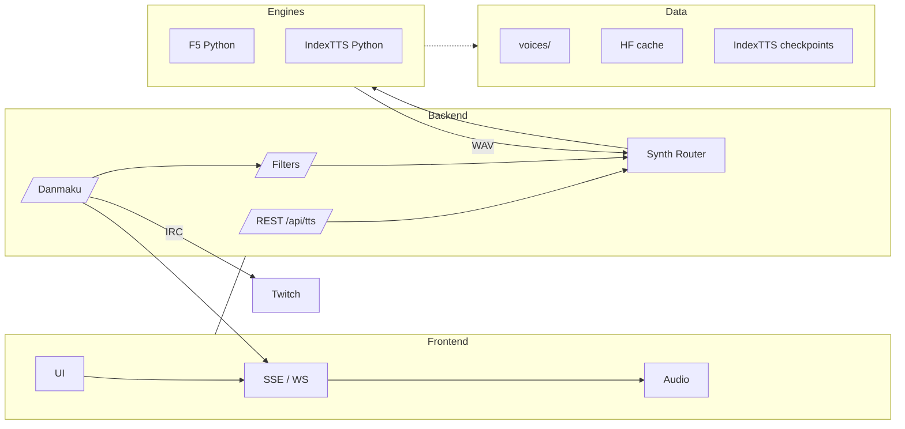

# iShowTTS

Local TTS pipeline for livestream danmaku on NVIDIA Jetson AGX Orin. Rust/Axum backend wraps F5-TTS + IndexTTS2; Yew/WASM frontend pulls voices, streams audio, and plays it instantly.

## Architecture

- **Backend (`crates/backend`)** – Axum API + danmaku 服务，输出 `/api/tts`、SSE `/api/danmaku/stream`。
- **TTS Engine (`crates/tts-engine`)** – Rust↔Python 桥接，调度 F5 与 IndexTTS。
- **Frontend (`crates/frontend-web`)** – Yew/WASM 单页，收听 SSE、播放音频。
- **Scripts** – `start_all.sh`、`run_backend.sh`、代理脚本等。
- **Config** – `config/ishowtts.toml`、`config/danmaku_gateway.toml`。



```
.
├── Cargo.toml              # Workspace configuration
├── config/
│   ├── ishowtts.toml       # Backend 主配置
│   └── danmaku_gateway.toml# 队列/过滤/默认 TTS 参数
├── crates/
│   ├── backend             # Axum + F5 runtime service
│   ├── frontend-web        # Web UI (Yew + WASM)
│   ├── frontend            # CLI 客户端 (可选)
│   └── tts-engine          # Python F5 wrapper
└── third_party             # Shimmy、F5-TTS 等子模块
```

## Quick start

1. **Bootstrap** – `./scripts/bootstrap_python_env.sh`，再安装 Jetson 版 `torch/torchaudio`。
2. **Assets** – `python -m f5_tts.download ...`；`snapshot_download('IndexTeam/IndexTTS-2', ...)`；准备声线并更新 `config/ishowtts.toml`。
3. **Build** – `cargo install trunk --locked --force`；`cargo build -p ishowtts-backend -p ishowtts-frontend`。
4. **Performance Mode** (推荐) – `sudo ./scripts/setup_performance_mode.sh` 锁定 GPU 频率以获得最佳性能（RTF 0.278 vs 0.352）。每次重启后需重新运行。
5. **Run** – `source /opt/miniforge3/envs/ishowtts/bin/activate`；`./scripts/start_all.sh --wait 900 --no-tail`；浏览器访问 `http://127.0.0.1:8080`。需要预热声线时，可改为 `cargo run -p ishowtts-backend -- --config config/ishowtts.toml --warmup` 再启动脚本。
6. **Stop / Restart** – `Ctrl+C` 或 `pkill -f ishowtts-backend && pkill -f trunk`；下次直接重新运行脚本即可。

## Prerequisites

Jetson AGX Orin + Rust ≥ 1.76 + Python ≥ 3.10。第三方依赖已在 bootstrap 脚本和 Quick start 中覆盖。

## Config quick reference

```toml
[f5]
model = "F5TTS_v1_Base"
python_package_path = "../third_party/F5-TTS/src"
# ckpt_file = "/opt/models/F5-TTS/model_1250000.safetensors"
# hf_cache_dir = "/opt/models/hf_cache"

[[f5.voices]]
id = "ishow"
reference_audio = "/opt/voices/ishow_ref.wav"
reference_text = "你的参考音频文本，建议是一段完整的话。"
language = "zh-CN"

default_voice = "ishow"

[shimmy]
model_name = "f5-tts-ishow"
template = "voice:ishow"
ctx_len = 256

# [index_tts]
# python_package_path = "../third_party/index-tts"
# config_file = "../third_party/index-tts/checkpoints/config.yaml"
# model_dir = "../third_party/index-tts/checkpoints"
# device = "cuda"
#
# [[index_tts.voices]]
# id = "ishow-index"
# reference_audio = "/opt/voices/ishow_ref.wav"
# reference_text = "同一段参考文本，或留空使用默认"
```

> **Important:** Replace `data/voices/demo_reference.wav` with a high-quality clip (≥3 s) of your target voice and update the config accordingly. The placeholder sample is only for wiring tests.

### IndexTTS 2 (optional)

1. `cd third_party/index-tts && pip install -e .`
2. 使用 Quick start 的 `snapshot_download`（或 ModelScope）获取权重。
3. 在 `[index_tts]` 中指向模型目录与参考音频；可与 F5 共用或独立。
4. 首次运行会生成 `indextts/utils/tagger_cache/*.fst`，迁移时记得同步。

启用后，前端下拉可在 F5 与 IndexTTS 间切换。

### Voice overrides

- 覆盖数据保存在 `data/voices/overrides/`，包含 `overrides.json` 与各声线的参考音频副本。
- 后端提供以下接口：
  - `GET /api/voices/{voice_id}/reference`：返回当前基线、自定义文本与更新时间。
  - `POST /api/voices/{voice_id}/reference`（`multipart/form-data`）：上传 `text` 与 `audio` 字段中的任意一项。
  - `DELETE /api/voices/{voice_id}/reference`：移除覆盖并恢复基线。
  - `GET /api/voices/{voice_id}/reference/audio?source=baseline|override`：下载对应参考音频。
- Web UI → “音色设置” 打开后可直接上传/重置参考文本与音频，保存后后台会立即应用并更新前端显示。

### Notes

- CLI 调试：`RUST_LOG=ishowtts=debug cargo run -p ishowtts-backend -- --config config/ishowtts.toml`；命令行前端 `cargo run -p ishowtts-frontend -- --voice <id>`。
- 弹幕推送：前端通过 SSE `/api/danmaku/stream` 自动恢复；`config/danmaku_gateway.toml` 控制节流与过滤。
- 代理：`sudo scripts/ssh_clash_proxy_toggle.sh on|off`（写入 SSH ProxyCommand + 系统代理，并开启对应 shell）；Twitch 登录需在 `config/ishowtts.toml` 填 `bot_username` + `oauth_token`。
- 并发与性能：`api.max_parallel` 和 `queue.rate_limit_per_sec` 调整吞吐；可选 TensorRT vocoder 指向 `vocoder_local_path`。
- 环境变量：`PYTHONPATH`、`HF_HOME` 可自定义缓存路径；交叉编译时设置 `CARGO_TARGET_AARCH64_UNKNOWN_LINUX_GNU_LINKER`。

## Maintenance & cleanup

- 停止服务：`pkill -f ishowtts-backend`、`pkill -f trunk`，或在运行 `start_all.sh` 的终端直接 `Ctrl+C`。
- 清理临时日志： `: > logs/backend.log`、`: > logs/frontend.log`（脚本会在下次启动时自动重建目录）。
- 释放构建缓存：`cargo clean` 会移除 `target/`；Python 依赖驻留在 `/opt/miniforge3/envs/ishowtts` 或 `.venv`，如需重建请手动删除。
- 模型缓存（F5、IndexTTS、HF assets）分别位于 `data/cache/huggingface/` 与 `third_party/index-tts/checkpoints/`，可视余量迁移或清理。FST 会写入 `third_party/index-tts/indextts/utils/tagger_cache/`。
- 更新依赖或本仓库后，重新运行 `./scripts/bootstrap_python_env.sh` 与 `cargo build -p ishowtts-backend` 以确保环境一致。

## Performance optimization

**Current status**: RTF = 0.278 (mean), 0.274 (best) ✅ Target: <0.30

实现 Whisper 级别 TTS 速度的关键优化：
- ✅ **torch.compile(mode='max-autotune')** – 模型和声码器 JIT 编译优化
- ✅ **FP16 自动混合精度** – 利用 Jetson Orin Tensor Cores 加速
- ✅ **参考音频张量缓存** – 避免重复预处理
- ✅ **CUDA 流异步传输** – CPU/GPU 操作并行
- ✅ **NFE=8 步优化** – 速度/质量平衡（config 可调）
- ✅ **GPU 频率锁定** – `setup_performance_mode.sh` 提供稳定性能

详细优化报告见 `.agent/FINAL_OPTIMIZATION_REPORT.md` 和 `.agent/STATUS.md`。

## Recent updates

- 新增 `/api/danmaku/stream` SSE 推送通道，前端刷新后自动恢复播放。
- `start_all.sh` 新增 `--wait <秒>`，默认 600 秒以容纳 IndexTTS 冷启动；脚本在退出时会清理 tail/trunk 进程。
- 默认并发提升至 3，并限制弹幕队列速率为每秒 10 条，必要时可在 TOML 中调整。
- 日志输出聚焦业务节点（收到弹幕、合成完成、SSE 关闭等），定位问题更加直接。
- 支持可选的 IndexTTS 2 推理链路，配置后可在 Web 前端模型下拉中即时切换。
- Web 前端的“文本转语音”面板新增模型/音色联动选择，并在历史记录中标注来源引擎。
- 新增声线覆盖管理：后端持久化 `data/voices/overrides/`，提供 `GET/POST/DELETE /api/voices/:id/reference`；前端“音色设置”弹窗可上传、下载或恢复参考文本/音频。

## License

This repository is distributed under the MIT License. The bundled third-party components retain their original licenses.
